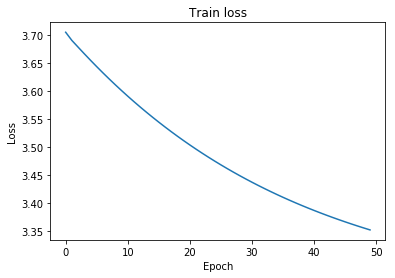
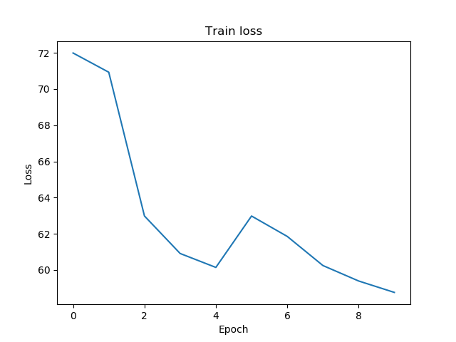
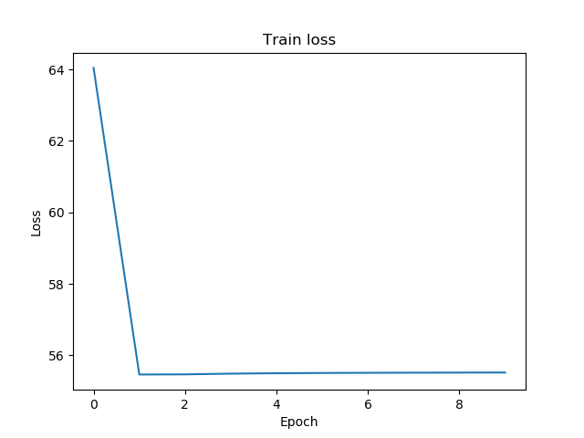

# Recursive Neural Networks
Recursive neural networks and Recursive Neural Tensor Network(RNTN) created in Tensorflow for sentiment analysis.

The train/test data can be downloaded at https://nlp.stanford.edu/sentiment/

##a) Naive implementation
Creating a Recursive Neural Network in Tensorflow is a little cumbersome as we need to create a graph for each tree in the train/test sets.

A common solution in other frameworks is to parse the tree into a sequence using post-traversal recursion.
Then we could create a tensor to save our calculations using slice assigments. This tensor can be reused by all our trees.

However; Tensorflow does not allow gradient backpropagation for slice assigments. Then it is necessary to create a separate tensorflow graph for each tree.

This solution creates:

a) Wh and bh tensors to be shared by all our hidden nodes.

        self.Wh = tf.Variable(np.random.rand(2, self.D, self.D)/np.sqrt(self.D), dtype = tf.float32)
        self.bh = tf.Variable(np.zeros(self.D), dtype = tf.float32)

b) Wo and bo output tensors to be shared by all the tree roots. I used a Tensorflow dense layer.

    logits = tf.layers.dense(output, units = self.n_outputs)
    
As mentioned before each tree created its own nodes in the graph.

    def _create_tensorflow_tree(self, node):
        if(node is None):
            return;
        left = self._create_tensorflow_tree(node.left)
        right = self._create_tensorflow_tree(node.right)
        if(node.word_idx is not None):
            return self.embeddings[[node.word_idx]] #Shape 1x50
        else:
            return self.activation(tf.matmul(left, self.W[0]) + tf.matmul(right, self.W[1]) + self.bh)
            
       
In order to avoid memory issues for having to many nodes, we train only a subset of the train sentences, save the model and train again with a different subset.

    def fit(self, trees, n_epochs = 50, checkpoint_file = "./recurrent_nn.ckpt"):
        #Creates a graph for each one of the trees in the training set, trains it and saves the final model on disk.
        self.checkpoint_file = checkpoint_file;
            
        if(self.train_operations is None):
            self._build(trees)
            
        self.sess = tf.Session();
    
        if(os.path.isfile(checkpoint_file + ".index")):
            self.saver.restore(self.sess, checkpoint_file)
        else:
            self.sess.run(self.init)

        total_loss = 0
        total_correct = 0
        n_batch = len(self.train_operations)
        for epoch in range(n_epochs):
            for operation in self.train_operations:
                prediction, is_correct, loss, __= self.sess.run(operation)
                total_loss += loss
                total_correct += is_correct[0] 
            print("Epoch:", epoch, "Accuracy:", total_correct/n_batch, "Loss:", total_loss)
            
        self.saver.save(self.sess, checkpoint_file)
        
Creating the nodes is computationally expensive, we will output a message after each tree is built:

    Tree 0 created...
    Tree 1 created...
    Tree 2 created...
    Tree 3 created...
    Tree 4 created...
    Tree 5 created...
    Tree 6 created...
    Tree 7 created...
    Tree 8 created...
    Tree 9 created...
    
The loss after training is shown next:

##b) Optimized implementation

Instead of constructing a tensorflow tree for each sentence, we first convert the original tree into 4 lists
that we will use later in tensorflow to fill in a symbolic matrix that will serve as a cache to store intermediate
computations.

These tree-array has the property that each row only depends on previous rows. That is, each row represents a node in the tree
and its children are previous rows in the tree-array. Then, use can use the tf.while_loop operation to iterate throw this array in
ascending order.

    final_hidden = tf.while_loop(lambda i, _: i < T, body, (0, self.hidden))

For the gradient to propagate we use a special tensorflow data structure called TensorArray. In this data structure we can save the intermediate
computations produced by the linear and quadratic transformations in the tree.

    def get_embedding(i, a):
        output = a.write(i, tf.nn.embedding_lookup(self.embeddings, self.x_input[i, 2]))
        return output;

    def update_node(i, a):
        left_child = a.read(self.x_input[i, 0])
        right_child = a.read(self.x_input[i, 1])
        logits_ = linear_mult(left_child, self.W[0]) + linear_mult(right_child, self.W[1]) + self.bh
        if (self.use_rntn):
            logits_ += (quad_mult(left_child, self.All, left_child) +
                        quad_mult(left_child, self.Alr, right_child) +
                        quad_mult(right_child, self.Arr, right_child));
        output = a.write(i, self.activation(logits_))
        return output;

    # [left, right, words, ratings]
    def body(i, a):
        node_op = tf.cond(tf.not_equal(self.x_input[i, 2], -1),
                          lambda: get_embedding(i, a),
                          lambda: update_node(i, a));
        return i + 1, node_op;

        

The last element in the TensorArray is the input to a dense layer that will serve to output the binary output that we need for
classification. 

    output = tf.reshape(final_hidden.read(T - 1), (1, self.D));
    logits = tf.layers.dense(output, units=self.n_outputs, kernel_initializer=tf.variance_scaling_initializer,
                             name="output_layer")

Finally, we train and test the model as usual.

Let's see the performance on the Recursive Neurla Network

    #Simple Recursive Neural Network
    ...
    Epoch: 7 Accuracy: 0.77 Loss: 61.7888609245
    Epoch: 8 Accuracy: 0.77 Loss: 60.8628167808
    Epoch: 9 Accuracy: 0.76 Loss: 59.3474670351
    Train accuracy:  0.77
    Test accuracy:  0.78
  
Now, compare it with a RNTN

    #Recursive Neural Tensor Network
    ...
    Epoch: 7 Accuracy: 0.77 Loss: 55.5150962025
    Epoch: 8 Accuracy: 0.77 Loss: 55.5176902711
    Epoch: 9 Accuracy: 0.77 Loss: 55.5196959227
    
    Train accuracy:  0.77
    Test accuracy:  0.78
    
Even though the cost is smaller in the RNTN the accuracy did not improve.